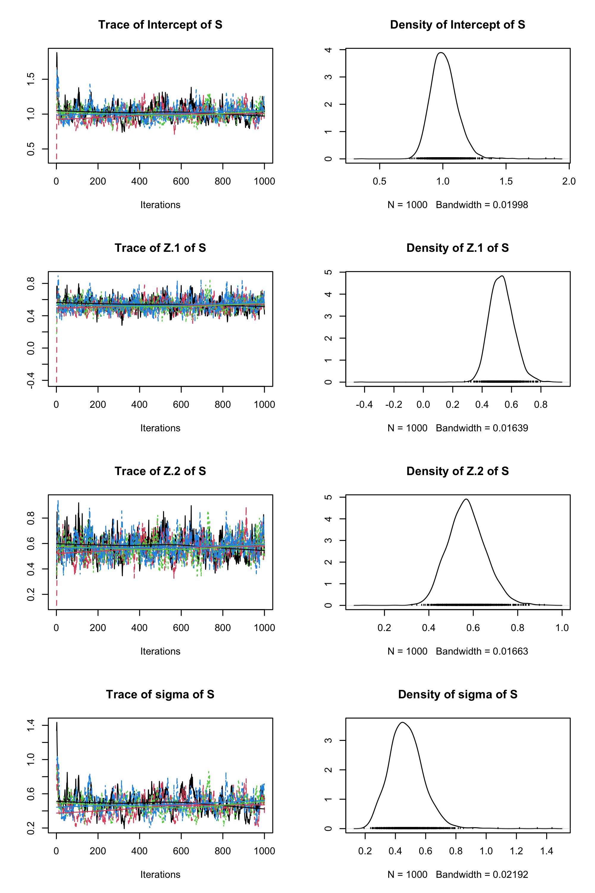
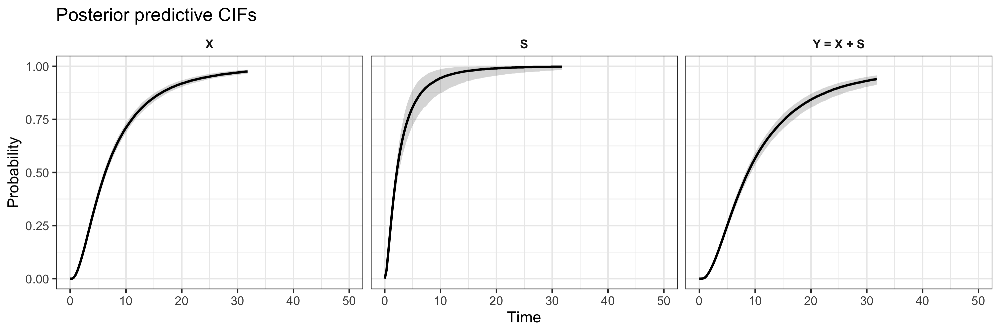
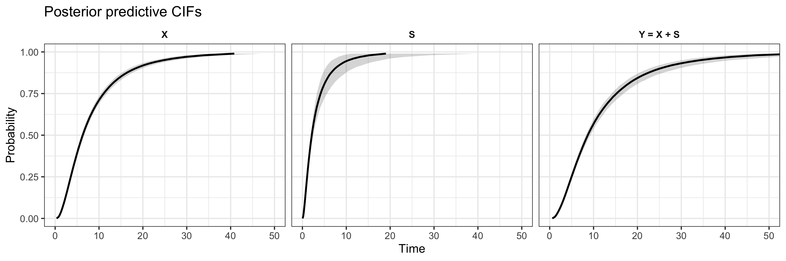

```{r, include = FALSE}
knitr::opts_chunk$set(
  collapse = TRUE,
  comment = "#>"
)
```

## Overview

In screening programs, individuals are usually followed up and tested (screened) for the development of a disease, such as cancer. The target disease often develops progressively in stages; for example healthy (state 1), pre-state disease (state 2), and the disease state (state 3). When the pre-state disease is found during screening it is intervened upon, for example by surgical removal of a lesion, so that the progression of the pre-state disease to disease is interrupted. This is one of the major objectives of many screening programs, such as colorectal cancer screening, breast cancer screening or cervical cancer screening.  

Researchers often want to estimate the time $x$ from baseline to the pre-state disease, the time $s$ from the pre-state disease to the disease, and the total time $x+s$ from baseline to the disease. In addition, researchers often want to regress these times on baseline covariates, such as age, gender, or bio-markers ($z$). In doing so, electronic health records from screening programs can serve as data. For $n$ individuals numbered $i=1,...,n$, these data typically consist of a series of time stamps (screening times) $v_{1i} < v_{2i} <...< v_{c_ii} < \infty$ at which screening tests have been carried out and a test result was obtained (e.g., $v_i = \{1, 3, 5, 8\}$ years after baseline). The number of screening times and their spacing may differ over individuals $i$ (i.e., irregular screening). Since pre-state diseases are intervened upon, the screening series end with a positive test outcome (either state 2 or 3) or loss to follow up (right censoring). Irefer to this observation process as panel data with censoring after intervention.  

`BayesTSM` is a progressive three-state semi-Markov model developed by Klausch et al. (2023) for screening panel data with censoring after intervention. An Accelerated Failure Time (AFT) specification is used to model the failure times $x$ and $s$ and regress them on covariates; specifically:

\begin{equation}
\begin{split}
\log x_i &= z_x^T \beta_x + \sigma_x \epsilon_i \\
\log s_i &= z_s^T \beta_s + \sigma_s \xi_i
\end{split}
(\#eq:aft)
\end{equation}

The independent error terms $\epsilon_i$ and $\xi_i$ are chosen such that common survival time distributions for $x$ and $s$ are induced. Currently, `BayesTSM` allows for Weibull, lognormal, and loglogistically distributed times. To estimate the model, `BayesTSM` utilizes a Bayesian estimation method (a Gibbs sampler). Klausch et al. (2023) showed how weakly informative priors on the parameters, applied by default in `BayesTSM`, help to regularize the likelihood surface of the model. Specifically, the likelihood can be flat when state 2 and 3 events are infrequent, which is common in practice. Akwiwu et al. (2026) showed that BayesTSM has better performance than other commonly available semi-Markov multi-state models, which can lead to wrong conclusions in practice. 

Here, I describe the usage of the `BayesTSM` package. An anlysis with `BayesTSM` consists of multiple steps using dedicated functions:

1. Model estimation and convergence diagnosis (function `bayestsm`)\
2. Information criteria estimation (function `get_IC`)\
3. Posterior summaries (functions `summary.bayestsm`, `plot.bayestsm`, `ppCIF` and `plot.ppCIF`)\

These functions are discussed in Section \@ref(sec-model-estimation), Section \@ref(sec-information-criteria), and Section \@ref(sec-posterior-summaries). Additional options are discussed in Section \@ref(sec-further-topics).

## Model estimation using `bayestsm` {#sec-model-estimation}

### Gibbs sampler {#sec-gibbs}

The function `bayestsm` estimates the parameters of model \@ref(eq:aft). Model estimation is done by means of a Gibbs sampler. As described in Klausch et al. (2023), the main steps of the Gibbs sampler are (after initialization)

1. Augment the unobserved times $x_i$ given the observed data (`d`, `L`, `R`, `X`, `S`), the augmented $s_i$, and the model parameters.\
2. Augment the unobserved times $s_i$ given the observed data (`d`, `L`, `R`, `X`, `S`), the augmented $x_i$, and the model parameters.\
3. Draw the model parameters from the complete data posterior distribution.\

These updating steps are run repeatedly. After a warmup period, the sampler yields auto-correlated draws from the target posterior distribution of the parameters.

The data augmentation procedure used in steps 1 and 2 is described in detail in Klausch et al. (2023). It can be understood as an imputation procedure in which all individuals receive a plausible draw of the unobserved true times $x_i$ and $s_i$ given the observed data. The model parameters can then be drawn from the complete data posterior

\begin{align}
q(\beta_x, \sigma_x, \beta_s, \sigma_s \mid x_i, s_i) \propto L(\beta_x, \sigma_x, \beta_s, \sigma_s \mid x_i, s_i)\pi(\beta_x, \sigma_x, \beta_s, \sigma_s)
\end{align}

where $L$ denotes the complete data likelihood function and $\pi$ the prior density function; see Section \@ref(sec-prior-assumptions). As can be seen, the complete data posterior distribution of `BayesTSM` does not depend on the observed data anymore since the missing times $x_i$ and $s_i$ have been augmented. Klausch et al. (2023) suggested a Metropolis-Hastings step to draw from the complete data posterior using a random walk normal proposal distribution. In addition, the current version of `BayesTSM` allows using univariate slice sampling to update the parameters one after another while holding the other parameters fixed. Our tests showed that slice sampling leads to faster model convergence than the initially proposed Metropolis step by Klausch et al. In addition, slice sampling usually does not require tuning of the sampler and hence is a convenient off-the-shelf approach to sampling the model parameters. Slice sampling is therefore used as the default parameter sampler in `BayesTSM`. Metropolis sampling can still be obtained through the option `MH = TRUE`; see Section \@ref(sec-metropolis).

### `bayestsm` input data structure {#sec-input-data}

`bayestsm` accepts five different types of variables as input arguments `d`, `L`, `R`, `Z.X`, and `Z.S`. These variables have to be available for all individuals in the data. Missing information has to be handled outside of `BayesTSM`.  

Argument `d` takes the type of censoring event with `1` denoting right censoring (loss to follow up), `2` denoting a pre-state event (e.g., pre-state disease / early disease), and `3` denoting a terminal state event (e.g., disease / late disease).  

Arguments `L` and `R` take, respectively, the left and right bound of the last screening interval. `BayesTSM` currently assumes that the screening test has perfect sensitivity and specificity (as noted by Klausch et al. (2023), slight deviations from this assumption usually lead to negligible bias). As a consequence, the possibly longer screening time series $v_1 < v_2 <...<v_c$ can be shortened to the last interval $(v_{c-1}, v_c]$, where the input variable `L` corresponds to $v_{c-1}$ and `R` corresponds to $v_c$ when `d = 2` or `d = 3`. When `d = 1` (right censoring), `BayesTSM` expects `L` to be the last follow-up moment ($v_c$) and `R` to be `Inf`.  

Arguments `Z.X` and `Z.S` take the covariates used in the AFT models for $x$ and $s$, respectively, both specified as $n \times p$ `matrix` objects. In principle, the number and type of covariates passed to `Z.X` and `Z.S` may differ, although, arguably, we often pass the same covariates to both transition models in practice. If no covariates are passed, `Z.X = NULL` and/or `Z.S = NULL` are specified and the resulting AFT model is an intercept-only model, respectively. Categorical variables have to be dummy coded outside of `BayesTSM` by the user. To do so, `stats::model.matrix` may be useful. In addition, the Gibbs sampler can be sensitive to large scale `sd` of continuous covariates. I advise to standardize any covariates with large scale, e.g. using `base::scale`.

`BayesTSM` has a built-in data simulation function which generates data under the data generation mechanism (i.e., the model) of Klausch et al. (2023); see `?gendat` for all options. Here I use `gendat` to generate example data and illustrate the function input arguments and model estimation.  

```{r}
library(BayesTSM)

# Generate data
set.seed(1)
dat = gendat(
             n = 1000,  # Sample size
             p = 2,     # Number of normally distributed covariates
             sigma.X = 0.3,         # True scale parameter of X
             mu.X    = 2,           # True intercept parameter of X
             beta.X  = c(0.5,0.5),  # True slope parameters of all covariates of X
             sigma.S = 0.5,         # True scale parameter of S
             mu.S    = 1,           # True intercept parameter of S
             beta.S  = c(0.5,0.5),  # True slope parameters of all covariates of S
             dist.X  = 'weibull',   # Distribution of X
             dist.S  = 'weibull',   # Distribution of S
             v.min   = 1,           # Minimum time between screening moments
             v.max   = 5,           # Maximum time between screening moments
             Tmax    = 2e2,         # Maximum number of screening times
             mean.rc = 10           # Mean time to right censoring, exponential distribution
)
```

`gendat` generates data for $x$ and $s$ for `n` data points. `p` covariates are simulated from a multivariate normal distribution. `gendat` also allows the option for a binary covariate, which I do not use in the example above. Parameters `sigma.X`, `mu.X`, and `beta.X` give respectively the scale parameter $\sigma_x$, the intercept parameter $\beta_0$ of the AFT model, and the slope parameters $\beta_1,...,\beta_p$ for the $x$-model. Furthermore, `sigma.S`, `mu.S`, and `beta.S` are the corresponding input arguments for the $s$-model. The arguments `dist.X` and `dist.S` specify the distributions of $x$ and $s$. Besides `weibull`, the `lognormal` and `loglog` (log-logistic) distributions are available.  

Subsequently, `gendat` generates visit times $v_i$ for all $i$ using the following process:

1. Sample $v_{i1} \sim \text{uniform}(v_{\text{min}}, v_{\text{max}})$
2. Repeatedly sample $v_{ij} \sim \text{uniform}(v_{ij-1}+v_{\text{min}}, v_{ij-1}+v_{\text{max}})$

Here, `v.min` and `v.max` can be specified. The right censoring mechanism can either be controlled via the maximum number of follow-up moments `Tmax` or via a right censoring time $v_{rc}$. When the next generated screening time $v_{ij}>v_{rc}$, right censoring after `v_{ij-1}` occurs. `gendat` assumes the right censoring time is exponentially distributed with parameter equal to one divided by `mean.rc`, so that `mean.rc` is the mean time to right censoring.  

Looking at the top rows of the generated `dat` illustrates the input structure required by `BayesTSM`. This type of data has to be matched by any real-world data passed to `BayesTSM` in practice.

```{r}
head(dat)
```

Specifically, `gendat` returns a `data.frame` with columns `L`, `R`, `d`, `X`, `S`, and the covariates, in this case `Z.1` and `Z.2`. `L` and `R` correspond to the bounds of the most recent screening interval if `d=2` or `d=3`, or an open interval with `L` denoting the last screening time and `R=Inf` if `d=1`. If an event (`d=2` or `d=3`) occurred in the first interval, i.e. between zero and the first screening time, which is sometimes called left censoring, the coding is kept (i.e., `L=0` and `R` the screening time at which the event was detected).  

Note that columns `X` and `S` give the true simulated screening times, which are not available in practice and are not passed to `BayesTSM`. Furthermore, `BayesTSM` assumes that all cases are in state `d=1` at time zero (baseline). Hence, baseline positive tests (also called prevalence) should be excluded before running `BayesTSM`. Cases with `L=0` and `R=Inf`, denoting a baseline negative test with right censoring before follow-up, may be part of the data. Including these cases does not change the likelihood of the parameters. However, when estimating marginalized statistics such as cumulative distribution functions (incidence functions), selection bias may occur if such cases are excluded. The practical effects of having many `L=0` and `R=Inf` observations in the data, however, have not been studied and are not yet well tested.

### Prior assumptions {#sec-prior-assumptions}

Klausch et al. (2023) showed that weakly informative priors for the model parameters are helpful to obtain consistent parameter estimates even in settings where advanced state events are infrequent. Specifically, Klausch et al. (2023) proposed Student-$t$ priors with four degrees of freedom for the intercept and slope coefficients $\beta_x$ and $\beta_s$. Furthermore, half-normal priors are used for the $\sigma_x$ and $\sigma_s$ parameters, where `bayestsm` by default uses a scale parameter of $1$. Klausch et al. (2023) suggested $\sqrt{10}$ as the default scale parameter. The posterior distributions may be sensitive to these prior parameter choices. Therefore, a prior sensitivity analysis can be useful to assess the robustness of findings to different prior parameters; see Klausch et al. (2023) for an example. 

In `bayestsm`, the degrees of freedom of the beta Student-$t$ prior are controlled by `beta.prior.X` (default 4) and `beta.prior.S` (default 4). The scale parameter of the half-normal prior is controlled through `sig.prior.X` (default 1) and `sig.prior.S` (default 1). In addition, the user can pass their own prior density function through argument `log_prior_fun`; see `?log_aft_prior` for guidelines on how the function has to be structured.

Alternatively, the `bayestsm` internal prior function `log_aft_prior` allows switching from the Student-$t$ prior to a normal prior for the model $\beta$ parameters by specifying option `beta.prior = 'norm'` in `bayestsm`. In that case, `beta.prior.X` and `beta.prior.S` are used to change the standard deviation of the normal prior distribution.

### Basic `bayestsm` run {#sec-basic-run}

Before running the sampler, the analyst should always check the distribution of events.

```{r}
table(dat$d)
```

In the case of our simulated data, about 60% of individuals have state 2 or state 3 events, which is ample for `BayesTSM` to run successfully. Care in model specification (e.g. number of covariates included and type of distribution chosen) should be taken when there are few state 2 or state 3 events. Although `BayesTSM` is designed to deal with a substantially smaller number of events and usually converges if the Gibbs sampler is run for a sufficient number of iterations, the precision of estimation may be low, especially when too many covariates are included with few advanced state events. 

We now run `bayestsm`; note again that the input format should align with the requirements described above in Section \@ref(sec-input-data).

```{r, eval = FALSE}
# Run bayestsm Gibbs sampler with data augmentation and slice sampling of the parameters

d = dat$d
L = dat$L
R = dat$R
Z = dat[, c("Z.1", "Z.2")]

mod_slice = bayestsm(
  d = d,
  L = L,
  R = R,
  Z.X = Z,
  Z.S = Z,
  mc = 1e4,
  warmup = 5e2,
  thinning = 10,
  chains = 4,
  update_till_convergence = FALSE,
  MH = FALSE,
  dist.X = "weibull",
  dist.S = "weibull",
  seed_chains = 1:4
)
```

`bayestsm` accepts data as arguments `d`, `L`, `R`, `Z.X`, and `Z.S`, as shown above. The desired distributions for $x$ and $s$ are passed via `dist.X` and `dist.S` with options `weibull`, `lognormal`, and `loglog` (log-logistic). In practice, the correct distribution is unknown. Therefore, multiple models can be compared with different distributions and the best model can be found using information criteria, such as the Widely Applicable Information Criterion (WAIC); for an example, see Klausch et al. (2023). In `BayesTSM`, the post-estimation function `get_IC` returns information criteria; see Section \@ref(sec-information-criteria). In addition, it can be considered to use an exponential distribution instead of one of the two-parameter distributions (Weibull, lognormal, or log-logistic). The exponential model is obtained from the Weibull distribution with $\sigma$ fixed at one. This step fixes $\sigma$ in the model and decreases uncertainty, which stabilizes estimation in sparse data settings, but is based on the assumption that hazards do not change across time (equivalent to a Markov model). I suggest resorting to the exponential specification only if the model is too imprecise or shows convergence issues. When an exponential model is desired, the analyst specifies `dist.X = "weibull"` and `fix.sigma.X = 1`. The latter argument by default is set to `FALSE`, which means that $\sigma_x$ is updated during model estimation. If instead a numeric value is given, $\sigma_x$ is held fixed at that value during model estimation. Hence, for `dist.X = "weibull"` and `fix.sigma.X = 1`, the special case of the exponential $x$-model emerges. The same holds for $s$ when using `dist.S = "weibull"` and `fix.sigma.S = 1`.

The basic behavior of the Gibbs sampler is controlled via the arguments `mc`, `warmup`, `chains`, `MH`, `thinning` and `seed_chains`. The initial call to `bayestsm` shown above lets `bayestsm` do `mc = 1e4` draws and then stop. A slice sampler is used since `MH = FALSE`; if `MH = TRUE`, Metropolis sampling would be used. `bayestsm` by default runs multiple MCMC `chains` in parallel, which is needed to estimate the convergence diagnostics reliably and to efficiently generate draws from the posterior distribution. I recommend a minimum of four `chains` for reliable convergence diagnostics estimation, but more is possible. The user's machine should have at least `chains` free CPUs available for the parallel `R` workers. If no parallel processing inside `bayestsm` is desired, the alternative `bayestsm_seq` function can be used; see Section \@ref(sec-sequential). It is identical to `bayestsm` but uses a `for` loop over chains intead. 

Each Gibbs sampler chain is randomly initialized. However, the user has control over the initialization seeds for chain, using argument `seed_chains`. One integer seed per chain has to be provided as a vector. For example `seed_chains = 1:4` specifies seeds 1 to 4 for a model that is estimated with `chains = 4`. Repeatedly running `bayestsm` with these seeds produces the same posterior chains and hence the same estimates. `seed_chains = NULL` initializes the chains randomly.

The Gibbs sampler is always initially run for `mc` draws, after which its convergence is evaluated and returned. `bayestsm` evaluates convergence as the rank-normalized R-hat by Vehtari et al. (2021) and the effective sample size (ESS) of the mean, computed by the `rhat` and `ess_mean` functions of the `posterior` `R` package (Bürkner et al., 2026). These statistics are printed to screen and available from the created `bayestsm` object. By default, `bayestsm` checks these values against those specified in `min_R` and `min_eff`, with defaults `1.01` and `chains * 100`, respectively, and prints to screen whether the run converged. If convergence is not achieved, the user can perform another batch of posterior draws using `prev.run`; see Section \@ref(sec-updating-runs). A user-friendly alternative is to let `bayestsm` run until convergence using `update_till_convergence = TRUE`; see Section \@ref(sec-auto-convergence). 

```text
Starting Gibbs sampler with 4 chains and 10000 iterations.
Not converged after 1000 stored iter/chain; update +10000 raw.
Convergence criteria: R-hat <= 1.010 and ESS >= 400.0
 block parameter R_hat    ESS
     X Intercept 1.000 2634.1
     X       Z.1 1.000 2878.8
     X       Z.2 1.002 2392.1
     X     sigma 1.002 2852.0
     S Intercept 1.025  188.6
     S       Z.1 1.010  416.5
     S       Z.2 1.010  413.9
     S     sigma 1.030  179.8
```

`bayestsm` automatically thins the chains through argument `thinning`. `thinning` means that only every `thinning` draw is saved, which can be useful to save machine memory and reduce autocorrelation between saved MCMC draws. By default, `bayestsm` does not thin the MCMC chain (`thinning = 1`), but thinning can be necessary when very long MCMC runs are required to obtain convergence. In this basic run, I chose `thinning = 10` so that after 10000 draws per chain, 1000 draws per chain are saved.

Before evaluation of convergence, `warmup` (unthinned / raw) iterations are discarded for warm-up. Since this integer is unknown a priori it is advisable to run `bayestsm` initially for `mc` iterations and inspect MCMC chains plots using `plot.bayestsm` to decide what a good `warmup` value is.

```{r, eval = FALSE}
plot(mod_slice, plot.X = F)
```

Looking at the MCMC trace plots for the parameters of the $s$-model, we can see that convergence is fast, and occurs within less than 100 (thinned) posterior draws (= less than 1000 raw draws).

```{r mcmc-traceplot, echo = FALSE, out.width = "100%", fig.cap = "Trace plots for the MCMC chains of the s-model (after thinning, 10000 raw draws)."}

```

### Updating previous `bayestsm` runs {#sec-updating-runs}

If an initial call to `bayestsm` has not converged the user can update a previous run through passing the `bayestsm` object to the `prev.run` argument in a new call to `bayestsm`. The number of added updates is controlled by the `mc_update` argument.

```{r, eval = FALSE}
# Updating previous run
mod_slice_update = bayestsm(
  prev.run = mod_slice, # pass previous bayestsm object
  mc_update = 2e4
)
```
```text
Updating previous MCMC run.
Starting Gibbs sampler with 4 chains and 20000 iterations.
Converged after 3000 stored iter/chain.
Convergence criteria: R-hat <= 1.010 and ESS >= 400.0
 block parameter R_hat    ESS
     X Intercept 1.000 8090.9
     X       Z.1 1.000 7788.1
     X       Z.2 1.000 7694.5
     X     sigma 1.001 9293.9
     S Intercept 1.006  890.5
     S       Z.1 1.002 1439.7
     S       Z.2 1.003 1475.4
     S     sigma 1.007  767.8
```

After updating for another `2e4` posterior draws the sampler has coverged (according to the default criteria specified by `min_R` and `min_eff`). The total number of iterations over which the Gibbs sampler has been run now is `3e4` with `3e3` iterations saved (`thinning = 10`). We have obtained sufficient draws for posterior inference.

### Automatic updating till convergence {#sec-auto-convergence}

Besides manual adding of posterior draws, `bayestsm` has a built-in automatic updating feature called by argument `update_till_convergence = TRUE`. In that case, if no convergence was obtained after `mc` initial Gibbs iterations (posterior draws), `bayestsm` adds another `mc_update` draws, after which convergence is re-evaluated. If still no convergence is obtained another batch of size `mc_update` is added and so on until convergence (specified by `min_R` and `min_eff`) or until the maximum number of iterations (`maxit`) is reached. `update_till_convergence = TRUE` can, of course, also be specified right away without an initial run, as demonstrated below showing successful convergence after `4e4` draws (stored `4e3`).

```{r, eval = FALSE}
# Automated updating till convergence
mod_slice_weibull = bayestsm(
  d = d,
  L = L,
  R = R,
  Z.X = Z,
  Z.S = Z,
  mc = 1e4,
  warmup = 5e2,
  thinning = 10,
  chains = 4,
  update_till_convergence = TRUE,
  mc_update = 1e4,
  MH = FALSE,
  dist.X = "weibull",
  dist.S = "weibull"
)
```
```text
Starting Gibbs sampler with 4 chains and 10000 iterations.
Not converged after 1000 stored iter/chain; update +10000 raw.
Convergence criteria: R-hat <= 1.010 and ESS >= 400.0
 block parameter R_hat    ESS
     X Intercept 1.000 2634.1
     X       Z.1 1.000 2878.8
     X       Z.2 1.002 2392.1
     X     sigma 1.002 2852.0
     S Intercept 1.025  188.6
     S       Z.1 1.010  416.5
     S       Z.2 1.010  413.9
     S     sigma 1.030  179.8


Not converged after 2000 stored iter/chain; update +10000 raw.
Convergence criteria: R-hat <= 1.010 and ESS >= 400.0
 block parameter R_hat    ESS
     X Intercept 1.000 5667.9
     X       Z.1 1.001 5642.5
     X       Z.2 1.001 5187.8
     X     sigma 1.000 5887.3
     S Intercept 1.009  471.1
     S       Z.1 1.004  795.6
     S       Z.2 1.005  801.3
     S     sigma 1.012  383.7


Not converged after 3000 stored iter/chain; update +10000 raw.
Convergence criteria: R-hat <= 1.010 and ESS >= 400.0
 block parameter R_hat    ESS
     X Intercept 1.000 8856.9
     X       Z.1 1.000 8339.7
     X       Z.2 1.000 7711.1
     X     sigma 1.000 8390.9
     S Intercept 1.011  700.6
     S       Z.1 1.004 1219.3
     S       Z.2 1.006 1147.5
     S     sigma 1.013  575.3


Converged after 4000 stored iter/chain.
Convergence criteria: R-hat <= 1.010 and ESS >= 400.0
 block parameter R_hat     ESS
     X Intercept 1.000 12139.7
     X       Z.1 1.000 11497.3
     X       Z.2 1.000 10289.1
     X     sigma 1.000 10830.2
     S Intercept 1.007  1033.9
     S       Z.1 1.002  1739.9
     S       Z.2 1.003  1656.2
     S     sigma 1.008   849.9
```

The model runtime (obtained from a fit on an 2025 Apple Mac Mini M4) is saved in 

```{r, eval = FALSE}
mod_slice_weibull$runtime
```
```
Time difference of 45.78194 secs
```

## Obtaining information criteria after running `bayestsm` {#sec-information-criteria}

`bayestsm` offers three distributions for the latent transition times, specified by the arguments `dist.X` and `dist.S` (`weibull`, `loglog`, `lognormal`). In practice, it is usually not known which distribution is best in a given application. Therefore, multiple models can be fitted and compared using information criteria. The function `get_IC` computes the deviance information criterion (DIC, Spiegelhalter et al. 2002), as well as two versions of the widely applicable information criterion (WAIC-1 and WAIC-2, Watanabe et al., 2010). The DIC is commonly used when the posterior is approximately multivariate normal, which is often not the case for BayesTSM because some posterior distributions may be skewed, depending on the data. The WAIC criteria are common alternatives in such settings.

In my experience, the two-parameter models `weibull`, `loglog`, and `lognormal` often have similar fit, and the choice among them usually has little impact on the regression slope coefficients or the cumulative distribution functions. The information criteria are then also similar. However, larger differences are often observed for the exponential distribution, which is a special case of the Weibull distribution with $\sigma$ constrained to 1. In `bayestsm`, this can be achieved by specifying `dist.X = "weibull"` and `fix.sigma.X = TRUE`; the same can be done for the $s$-model using `dist.S = "weibull"` and `fix.sigma.S = TRUE`. Below, we estimate two alternative models, one lognormal and one exponential, and compare their information criteria.

We first fit the models as follows:

```{r, eval = FALSE}
# Lognormal model
mod_slice_lognormal = bayestsm(
   d = d,
   L = L,
   R = R,
   Z.X = Z,
   Z.S = Z,
   mc = 1e4,
   warmup = 5e2,
   thinning = 10,
   chains = 4,
   update_till_convergence = TRUE,
   mc_update = 1e4,
   MH = FALSE,
   dist.X = "lognormal",
   dist.S = "lognormal",
   seed_chains = 5:8
 )
```
```text
Starting Gibbs sampler with 4 chains and 10000 iterations.
Not converged after 1000 stored iter/chain; update +10000 raw.
Convergence criteria: R-hat <= 1.010 and ESS >= 400.0
 block parameter R_hat    ESS
     X Intercept 1.000 3413.8
     X       Z.1 1.001 2959.8
     X       Z.2 1.000 3117.9
     X     sigma 0.999 2260.3
     S Intercept 1.001  815.9
     S       Z.1 1.005  561.5
     S       Z.2 1.003  588.0
     S     sigma 1.011  340.9


Converged after 2000 stored iter/chain.
Convergence criteria: R-hat <= 1.010 and ESS >= 400.0
 block parameter R_hat    ESS
     X Intercept 1.000 7479.9
     X       Z.1 1.000 6186.9
     X       Z.2 1.001 6308.8
     X     sigma 1.000 4963.7
     S Intercept 1.001 1662.4
     S       Z.1 1.000 1178.4
     S       Z.2 1.001 1164.7
     S     sigma 1.002  708.1
```
```{r, eval = FALSE}
# Exponential model
mod_slice_exponential = bayestsm(
   d = d,
   L = L,
   R = R,
   Z.X = Z,
   Z.S = Z,
   mc = 1e4,
   warmup = 5e2,
   thinning = 10,
   chains = 4,
   update_till_convergence = TRUE,
   mc_update = 1e4,
   MH = FALSE,
   dist.X = "weibull",
   dist.S = "weibull",
   fix.sigma.X = T, # Fix sigma.X at sig.prior.X (default 1)
   fix.sigma.S = T, # Fix sigma.S at sig.prior.S (default 1)
   seed_chains = 9:12
 )
```
```text
Starting Gibbs sampler with 4 chains and 10000 iterations.
Converged after 1000 stored iter/chain.
Convergence criteria: R-hat <= 1.010 and ESS >= 400.0 for sampled parameters; fixed sigma parameters excluded.
 block parameter R_hat    ESS
     X Intercept 1.000 3866.5
     X       Z.1 1.000 3422.4
     X       Z.2 1.000 3549.0
     S Intercept 1.001 2389.9
     S       Z.1 1.000 2766.7
     S       Z.2 1.000 2530.0
```

As can be seen, the exponential model obtains a larger effective sample size and smaller R-hat values in fewer iterations than the Weibull or lognormal models. This speedup results from the stronger constraints imposed by fixing $\sigma$. However, in the initial data generation using `gendat`, we fixed `sigma.X` at `0.3` and `sigma.S` at `0.2`. The exponential model assumption that these values are equal to one is therefore strongly violated. This can be seen by inspecting the sigma estimates, as described in more detail in Section \@ref(sec-parameter-summaries). In addition, the information criteria reflect this lack of fit, with higher values denoting worse fit.

```{r, eval=F}
get_IC(mod_slice_weibull, warmup =500, cores = NULL)
```
```text
        WAIC1    WAIC2      DIC
[1,] 1830.464 1830.704 1830.982
```
```{r, eval=F}
get_IC(mod_slice_lognormal, warmup =500, cores = NULL)
```
```text
        WAIC1    WAIC2      DIC
[1,] 1883.824 1884.098 1883.716
```
```{r, eval=F}
get_IC(mod_slice_exponential, warmup =500, cores = NULL)
```
```text
        WAIC1    WAIC2      DIC
[1,] 2493.822 2493.891 2495.685
```

Indeed, the Weibull model has the best fit, reflecting that the data were generated under a true Weibull model using `gendat`. The lognormal model has worse fit, although it remains close to the Weibull model. The exponential model has the worst fit among the three candidate models indicating that fixing the $\sigma$ parameters are 1 is probably not a good idea.

Note that by default `get_IC` uses all posterior samples available in the `bayestsm` model object, dropping only a number of samples as `warmup`, to estimate the information criteria. The precision of estimation can depend on the number of posterior samples used. By default, `get_IC` uses two CPUs to estimate the criteria. Since estimation is computational expensive, and scales linearly in the number of posterior samples, using more `cores` speeds up estimation. Specifying `cores = NULL` lets `get_IC` determine the maximum number of available cores on the local machine and distributes computation over these.

## Posterior summaries after running `bayestsm` {#sec-posterior-summaries}

After estimating a model, the main interest usually lies in posterior inference on the parameters. In addition, plots of state transition probabilities as a function of time can be informative. For both goals, `BayesTSM` offers built-in functionality: parameter summaries are discussed in Section \@ref(sec-parameter-summaries), and posterior predictive transition probability plots are discussed in Section \@ref(sec-cifs).

### Posterior summaries of the model parameters {#sec-parameter-summaries}

Model estimation is performed using a Gibbs sampler, which produces `mc` samples from the posterior distribution. If the model is updated, as described in Section \@ref(sec-updating-runs) and Section \@ref(sec-auto-convergence), the total number of samples may be higher than the initial `mc` draws. In addition, multiple `chains` are run with different randomly initialized values. This allows estimation of the R-hat convergence diagnostic and efficiently produces more samples simultaneously through parallel computation.

The posterior samples of the model parameters $(\beta_x, \sigma_x, \beta_s, \sigma_s)$ are available in the `bayestsm` object as the list elements `par.X` and `par.S`, respectively, each as an `MCMCpack::mcmc.list()` object (Martin et al., 2011). This allows straightforward plotting of the MCMC trace plots through `MCMCpack::plot.mcmc.list()`. By default, the plotting method for `bayestsm` objects calls this function to plot the trace plots and posterior densities. For example:

```{r, eval=FALSE}
plot(mod_slice_weibull)
```

Sometimes it can be helpful to omit some iterations as warmup to improve the scaling of the trace plots.

```{r, eval=FALSE}
plot(mod_slice_weibull, warmup = 500)
```

Posterior summaries of the parameter estimates are efficiently obtained through `bayestsm`'s `summary` method.

```{r, eval = FALSE}
summary(mod_slice_weibull, warmup = 500)
```

```text
Parameters of x-model
           2.5%   50% 97.5% R_hat    ESS
Intercept 1.976 2.004 2.034     1 9299.7
Z.1       0.482 0.514 0.548     1 8900.7
Z.2       0.445 0.477 0.512     1 7755.0
sigma     0.273 0.295 0.319     1 9175.4

Parameters of s-model
           2.5%   50% 97.5% R_hat    ESS
Intercept 0.837 1.000 1.212 1.006  904.6
Z.1       0.390 0.525 0.694 1.003 1455.8
Z.2       0.416 0.562 0.741 1.003 1446.5
sigma     0.286 0.462 0.688 1.008  745.7

Convergence criteria: R-hat <= 1.010 and ESS >= 400.0

Total posterior draws saved after thinning: 12000 (total draws: 120000)
```

The `summary` method focuses on posterior medians and 95% credible intervals. For posterior means, additional quantiles, and variance estimates, the user may use, for example:

```{r, eval = FALSE}
summary(mod_slice_weibull$par.X)
```

which uses `MCMCpack`'s built-in summary function for `mcmc.list` objects (Martin et al., 2011). Here, care should be taken to omit some iterations as warmup. This can be achieved, for example, through the `BayesTSM` function `trim.mcmc`.

```{r, eval = FALSE}
summary( trim.mcmc( mod_slice_weibull$par.X, burnin = 500) )
```

```text
Iterations = 500:3000
Thinning interval = 1 
Number of chains = 4 
Sample size per chain = 2501 

1. Empirical mean and standard deviation for each variable,
   plus standard error of the mean:

            Mean      SD  Naive SE Time-series SE
Intercept 2.0040 0.01463 0.0001463      0.0001537
Z.1       0.5144 0.01664 0.0001664      0.0001865
Z.2       0.4773 0.01692 0.0001692      0.0002046
sigma     0.2948 0.01149 0.0001149      0.0001263

2. Quantiles for each variable:

            2.5%    25%    50%    75%  97.5%
Intercept 1.9754 1.9942 2.0039 2.0137 2.0328
Z.1       0.4822 0.5030 0.5142 0.5256 0.5480
Z.2       0.4450 0.4659 0.4771 0.4885 0.5115
sigma     0.2730 0.2869 0.2946 0.3025 0.3185
```

It can be seen that the estimates are close to the true values specified in the data generation using `gen.dat` and the posterior (credible) intervals cover the true values.

### Posterior cumulative transition probability plots (CDFs / CIFs) {#sec-cifs}

A relevant question in screening data research is: what is the probability of progression to pre-state disease and disease as a function of time? `BayesTSM` has built-in functionality to estimate posterior predictive transition probabilities up to a given point in time. These probabilities are given by the cumulative distribution functions (CDFs) of the latent times. Depending on the field of study, CDFs are sometimes also called cumulative incidence functions (CIFs). `BayesTSM` uses the CIF terminology. Specifically, the function `ppCIF` allows estimation of three CIFs:

\begin{align}
F_x(x_0 \mid \beta_x, \sigma_x) &= P(x \le x_0 \mid \beta_x, \sigma_x),\\
F_s(s_0 \mid \beta_s, \sigma_s) &= P(s \le s_0 \mid \beta_s, \sigma_s),\\
F_y(y_0 \mid \beta_x, \sigma_x, \beta_s, \sigma_s) &= P(y \le y_0 \mid \beta_x, \sigma_x, \beta_s, \sigma_s),
\end{align}

where $x$ is the time from baseline to the second state, for example pre-state disease; $s$ is the time from the second state to the third state, for example disease; and $y = x+s$ is the time from baseline to the third state. The distribution of $y$ involves the convolution of $x$ and $s$, which is generally not available in closed form for the distributions offered by `BayesTSM`.

The CIFs shown above are called marginal CIFs because they do not condition on any covariates $z$. By contrast, CIFs that condition on one or more covariate values $z$ are called conditional CIFs:

\begin{align}
F_x(x_0 \mid z, \beta_x, \sigma_x) &= P(x \le x_0 \mid z, \beta_x, \sigma_x),\\
F_s(s_0 \mid z, \beta_s, \sigma_s) &= P(s \le s_0 \mid z, \beta_s, \sigma_s),\\
F_y(y_0 \mid z, \beta_x, \sigma_x, \beta_s, \sigma_s) &= P(y \le y_0 \mid z, \beta_x, \sigma_x, \beta_s, \sigma_s).
\end{align}

The function `ppCIF` estimates the percentiles $F_x$, $F_s$, and $F_y$ for supplied quantiles (`type = 'quantiles'`), or the quantiles $F^{-1}_x$, $F^{-1}_s$, and $F^{-1}_y$ for supplied percentiles (`type = 'percentiles'`), for both marginal and conditional CIFs. Percentiles of `F_x` and `F_s` can be obtained analytically, while percentiles of `F_y` are obtained by simulation. Quantiles are always obtained by simulation. `ppCIF` offers the options `method = c("simulation", "analytic")`, which give almost equivalent results in practice.

We distinguish two main use cases:

1. Obtaining posterior transition probabilities for single supplied time points
2. Obtaining posterior transition probabilities or quantiles for plotting CIFs

#### Predictive probabilities for single supplied time points {#sec-single-time-cifs}

The first objective usually uses the option `type = 'quantiles'` and supplies a small number of time points at which the posterior predictive probabilities should be evaluated. The code below estimates the posterior predictive cumulative transition probabilities up to 5 and 10 time units.

```{r, eval = FALSE}
ppCIF( mod_slice_weibull, 
       type = 'quantiles',  
       warmup = 500, 
       quant = c(5, 10) )
```

```text
Obtaining the posterior predictive CDFs of X, S, and X+S=Y by Monte Carlo simulation.
$med.p.x
[1] 0.391 0.710

$med.p.s
[1] 0.809 0.945

$med.p.y
[1] 0.252 0.568

$p.x.ci
       [,1]  [,2]
2.5%  0.367 0.687
97.5% 0.416 0.732

$p.s.ci
          [,1]  [,2]
2.5%  0.713000 0.871
97.5% 0.897025 0.989

$p.y.ci
       [,1]  [,2]
2.5%  0.230 0.534
97.5% 0.272 0.597

$grid
[1]  5 10

$type
[1] "quantiles"
```

For example, the median predicted probability of transition to state 2 by 5 time units is 0.391, with a 95% credible interval of [0.367, 0.416]. The median predicted probability of transition to state 3 by 5 time units is 0.252, with a 95% credible interval of [0.230, 0.272].

These are marginal probabilities, understood as transition probabilities averaged over the observed covariate distribution. They can also be interpreted as the transition probabilities for a randomly selected individual from the population. Often, however, conditional probabilities are also of interest. These condition on one or more covariate values. In `ppCIF`, conditional probabilities are specified through the arguments `fix_Z.X` and `fix_Z.S`. Specifically, if `fix_Z.X = NULL` and `fix_Z.S = NULL`, marginal cumulative posterior transition probabilities are obtained; this is the default. If conditioning on a covariate vector is desired, a vector of length `ncol(Z.X)` or `ncol(Z.S)` is passed to `fix_Z.X` or `fix_Z.S`, respectively. For example,

```{r, eval = FALSE}
fix_Z.X = c(1, 1)
fix_Z.S = c(1, 1)
```

conditions estimation on both covariates in `Z.X` and `Z.S` having the value 1. It is also possible to condition on some covariates while marginalizing over others. For this, the entries corresponding to the columns of `Z.X` and `Z.S` over which marginalization should be performed are set to `NA`. For example,

```{r, eval = FALSE}
fix_Z.X = c(1, NA)
fix_Z.S = c(1, NA)
```

conditions on the first covariate being 1, while marginalizing over the second covariate.

```{r, eval = FALSE}
ppCIF( mod_slice_weibull, 
       type = 'quantiles',  
       warmup = 500, 
       quant = c(5, 10),
       fix_Z.X = c(1, NA),
       fix_Z.S = c(1, NA)
)
```

```text
Obtaining the posterior predictive CDFs of X, S, and X+S=Y by Monte Carlo simulation.
$med.p.x
[1] 0.1190 0.4605

$med.p.s
[1] 0.658 0.911

$med.p.y
[1] 0.04 0.26

$p.x.ci
       [,1]     [,2]
2.5%  0.096 0.422975
97.5% 0.144 0.499025

$p.s.ci
          [,1]     [,2]
2.5%  0.512000 0.769975
97.5% 0.820075 0.985025

$p.y.ci
       [,1]  [,2]
2.5%  0.028 0.221
97.5% 0.055 0.299

$grid
[1]  5 10

$type
[1] "quantiles"

attr(,"class")
[1] "ppCIF"
```

The estimated probabilities now differ from the previous estimates because they condition on the first covariate being 1.

#### Plotting CIFs {#sec-plotting-cifs}

Instead of evaluating the posterior predictive CIF at a few pre-specified values, as in Section \@ref(sec-single-time-cifs), we can also evaluate it across a fine grid of quantiles. The resulting percentiles can then be plotted against that grid. `ppCIF` has a plotting method, `plot.ppCIF`, that provides a default quick view of the resulting CIFs. Alternatively, the user can create custom plots using the returned vectors `$med.p.x`, `$med.p.s`, and `$med.p.y`, together with the associated credible intervals. Here, I demonstrate the default plotting method.

```{r, eval = FALSE}
pp_grid <- ppCIF( mod_slice_weibull, type = 'quantiles',  warmup = 500 )
plot(pp_grid, xlim=c(0,50))
```

```text
Obtaining the posterior predictive CDFs of X, S, and X+S=Y by Monte Carlo simulation.
Quantiles were not provided and therefore chosen automatically.
```

Since no `quant` grid was provided, `ppCIF` chooses a grid automatically, scaled between 0 and the maximum finite screening time.

```{r ppCIF, echo = FALSE, out.width = "100%", fig.cap = "Posterior predictive CIFs obtained via default quantile grid."}

```

A similarly effective way to create CIF plots is to provide a fine grid of percentiles between 0 and 1 and let `ppCIF` obtain the associated quantiles.

```{r, eval = FALSE}
pq_grid <- ppCIF( mod_slice_weibull, type = 'percentiles',  warmup = 500 )
plot(pq_grid, xlim=c(0,50))
```

```{r pqCIF, echo = FALSE, out.width = "100%", fig.cap = "Posterior predictive CIFs obtained via default percentile grid."}

```

The resulting plots differ only with regard to the maximum obtained quantile. Some tuning of either the argument `quant` for `type = 'quantiles'` or the argument `perc` for `type = 'percentiles'` may be needed to obtain sufficiently high quantile cut-offs for the desired plotting result.

The resulting plots are marginalized across the covariates and therefore show marginal CIFs. Conditional variants can be obtained in the same way as described in Section \@ref(sec-single-time-cifs), that is, by fixing values through the arguments `fix_Z.X` and `fix_Z.S`.

## Further topics and functionalities {#sec-further-topics}

In this section, we discuss several further options to change the behavior of `bayestsm`. 

### Metropolis sampler {#sec-metropolis}

By default, the current implementation of `bayestsm` uses a slice sampler to sample from the complete-data posterior of the parameters after data augmentation in the Gibbs sampler. By contrast, the first implementation proposed by Klausch et al. (2023) used a random-walk Metropolis sampler with a multivariate normal proposal distribution. In `bayestsm`, both samplers are available: `MH = FALSE` calls the slice sampler, whereas `MH = TRUE` calls the Metropolis sampler.

Unlike slice sampling, the Metropolis sampler moves through the posterior distribution by proposing random jumps from a multivariate normal distribution with dimension equal to the number of model parameters ($\sigma$ is sampled on the log scale). By default, the proposal covariance matrix is diagonal with the same variance for all parameters, and its standard deviation has to be passed to `bayestsm` through the argument `prop.sd`. If `prop.sd = NULL`, a useful proposal standard deviation is selected in a pilot run using the heuristic search algorithm described in Klausch et al. (2023). The algorithm resembles adaptive Metropolis sampling and has so far proven reliable for finding proposal standard deviations that yield acceptance rates close to the 20% to 25% range. An acceptance rate of 23% is often quoted as desirable for efficient sampling from the posterior under multivariate normality conditions (Roberts et al., 1996). Other target ranges can be specified by calling `search_prop_sd` on an initial short `bayestsm` run; see `?search_prop_sd`.

To fit a model with Metropolis sampling instead of slice sampling, the only option that needs to be changed is `MH = TRUE`. With the default `prop.sd = NULL`, a suitable proposal standard deviation is searched automatically. All other aspects of the `bayestsm` call remain unchanged and are discussed in Section \@ref(sec-basic-run), Section \@ref(sec-updating-runs), and Section \@ref(sec-auto-convergence). However, I recommend specifying a substantially larger number of Gibbs iterations `mc` and a larger number of `warmup` iterations, as shown below.

```{r, eval = FALSE}
mod_MH = bayestsm(
  d = d,
  L = L,
  R = R,
  Z.X = Z,
  Z.S = Z,
  mc = 5e5,
  warmup = 1e5,
  thinning = 100,
  chains = 4,
  update_till_convergence = TRUE,
  MH = TRUE,
  dist.X = "weibull",
  dist.S = "weibull",
  seed_chains = 1:4
)
``` 
```
No proposal sd provided. Searching.
Iteration 1
Averaged acceptance rate: 0.357
sd set to 0.016
Iteration 2
Averaged acceptance rate: 0.233
Success with sd=0.016
Repeating for 10000 posterior draws.
Iteration 3
Averaged acceptance rate: 0.183
sd set to 0.013
Iteration 4
Averaged acceptance rate: 0.193
sd set to 0.011
Iteration 5
Averaged acceptance rate: 0.214
Success with sd=0.011
Repeating for 20000 posterior draws.
Iteration 6
Averaged acceptance rate: 0.236
Success with sd=0.011
Search completed.
Starting Gibbs sampler with 4 chains and 500000 iterations.
```

The progress output printed to the screen shows the tuning of the proposal standard deviation of the Metropolis sampler, followed by a note that the Gibbs sampler has started. Since a substantially larger number of Gibbs iterations is carried out, substantially longer computation times can be expected compared with slice sampling. However, because the Metropolis sampler implementation itself is fast, model estimation can still be completed in acceptable runtime.

```
Not converged after 5000 stored iter/chain; update +500000 raw.
Convergence criteria: R-hat <= 1.010 and ESS >= 400.0
 block parameter R_hat     ESS
     X Intercept 1.000 10743.2
     X       Z.1 1.000 11408.8
     X       Z.2 1.000  9338.5
     X     sigma 1.001  6577.4
     S Intercept 1.018   354.0
     S       Z.1 1.011   569.3
     S       Z.2 1.011   624.9
     S     sigma 1.031   229.4


Not converged after 10000 stored iter/chain; update +500000 raw.
Convergence criteria: R-hat <= 1.010 and ESS >= 400.0
 block parameter R_hat     ESS
     X Intercept 1.000 23357.7
     X       Z.1 1.000 24879.2
     X       Z.2 1.000 21004.9
     X     sigma 1.000 12071.0
     S Intercept 1.011   751.7
     S       Z.1 1.007  1144.7
     S       Z.2 1.006  1292.1
     S     sigma 1.015   538.7


Converged after 15000 stored iter/chain.
Convergence criteria: R-hat <= 1.010 and ESS >= 400.0
 block parameter R_hat     ESS
     X Intercept 1.000 34892.7
     X       Z.1 1.000 38553.0
     X       Z.2 1.000 32043.2
     X     sigma 1.000 17583.1
     S Intercept 1.005  1197.7
     S       Z.1 1.004  1853.6
     S       Z.2 1.003  1992.8
     S     sigma 1.007   871.7
```

In this example, I used update steps of `5e5` with `thinning=100` and omitted the first `1e5` iterations as warmup. Convergence was obtained after 1.5 million raw iterations per chain.

```{r, eval = F}
summary(mod_MH)
```
```
Parameters of x-model
           2.5%   50% 97.5% R_hat     ESS
Intercept 1.975 2.004 2.033     1 34892.7
Z.1       0.482 0.514 0.547     1 38553.0
Z.2       0.445 0.477 0.511     1 32043.2
sigma     0.273 0.294 0.318     1 17583.1

Parameters of s-model
           2.5%   50% 97.5% R_hat    ESS
Intercept 0.835 1.003 1.215 1.005 1197.7
Z.1       0.395 0.529 0.706 1.004 1853.6
Z.2       0.417 0.562 0.751 1.003 1992.8
sigma     0.287 0.466 0.697 1.007  871.7

Convergence criteria: R-hat <= 1.010 and ESS >= 400.0

Total posterior draws saved after thinning: 60000 (total draws: 6000000)
```

The posterior summary statistics are very similar to those from the slice sampler fit shown in Section \@ref(sec-parameter-summaries).

```{r, eval = F}
mod_MH$runtime
```
```
Time difference of 7.52409 mins
```

The model runtime was 7.52 minutes on a 2025 Apple Mac Mini M4 and was therefore substantially longer than the same model fit by slice sampling until convergence, which took about 45 seconds; see Section \@ref(sec-auto-convergence). However, a fairer comparison considers the effective sample size generated per second:

```{r, eval = FALSE}
ess_per_second_slice <- mod_slice_weibull$convergence$eff_s /
                        as.numeric(mod_slice_weibull$runtime, units = "secs")

ess_per_second_MH <- mod_MH$convergence$eff_s /
                     as.numeric(mod_MH$runtime, units = "secs")

rbind(ess_per_second_slice, ess_per_second_MH)
```
```
                     Intercept       Z.1       Z.2     sigma
ess_per_second_slice 19.758764 31.798440 31.595294 16.287304
ess_per_second_MH     2.652929  4.105893  4.414367  1.930899
```

This comparison shows that, for the parameters of the `s`-model, the slice sampler generates about 7 to 9 times more effective samples per second than MH.

### Slice sampler step size {#sec-slice-step-size}

An interesting property of the slice sampler is that it usually requires less tuning than the Metropolis sampler, which needs a suitable proposal variance for the jumping distribution. However, the slice sampler also has a tuning parameter: the step size used in its so-called step-out algorithm. In `bayestsm`, this parameter is controlled by `slicesampler_stepsize`, with default value `slicesampler_stepsize = 1`.

In most applications, the default step size works well and rarely needs to be changed. The step size does not affect the target posterior distribution, but it can affect computational efficiency. If the step size is too small, the sampler may require many step-out steps before finding a suitable interval. If it is too large, the sampler may spend more time shrinking the interval before accepting a draw. Therefore, if the slice sampler mixes slowly or requires surprisingly long computation time, changing `slicesampler_stepsize` can be useful.

### Specifying a user-defined prior function {#sec-user-defined-prior}

`BayesTSM` uses pre-specified weakly informative priors by default. Specifically, Student-$t$ priors are used for the intercept and $\beta$ parameters, and half-normal priors are used for the $\sigma$ parameters. The `bayestsm` arguments `beta.prior.X` and `beta.prior.S` control the number of degrees of freedom of the $t$ prior (default: 4). The arguments `sig.prior.X` and `sig.prior.S` control the scale parameter of the half-normal priors (default: 1). In addition, changing the default argument `beta.prior = 't'` to `beta.prior = 'norm'` switches to normal priors for the $\beta$ parameters. In that case, `beta.prior.X` and `beta.prior.S` are used to specify the prior standard deviation. These priors have been tested in various `bayestsm` settings and have proven to provide sufficient regularization to enable model estimation while not causing noticeable bias.

In addition, `bayestsm` allows the user to specify custom prior distribution functions. For this, the log-prior function has to be written in `R` and passed to the argument `log_prior_fun`; see also `?log_aft_prior`. Specifically, `log_aft_prior` is the default log-prior function used by `bayestsm`, whose input arguments are given by:

```{r, eval = F}
log_aft_prior <- function(eta, tau = 4, sig.prior = 1, beta.prior = "t") { ... }
```

Any user-written log-prior function has to take the same input arguments as `log_aft_prior`. Specifically, `eta` is the vector of the $\beta$ AFT model parameters, with the $\sigma$ AFT model parameter appended in the last position on the log scale. 

The argument `tau` is related to the `bayestsm` input arguments `beta.prior.X` and `beta.prior.S`. Internally, `beta.prior.X` is passed to `tau` for the $x$-model through a call to `log_prior_fun`, and `beta.prior.S` is passed to `tau` for the $s$-model through another call to `log_prior_fun`. Similarly, `sig.prior.X` and `sig.prior.S` are passed to `sig.prior`. Through this structure, the user can write any custom log-prior function and pass prior parameters to that function. In addition, the argument `beta.prior` may be used to switch between different priors, as in `log_aft_prior`, or to pass other information to the function.

Note: in the current implementation of `BayesTSM`, I have observed that the slice sampler can react sensitively to changes in the default prior during warmup. In such cases, it may produce extreme parameter estimates in the first few Gibbs iterations, which can cause the sampler to stop with an error. If that happens, changing to `MH = TRUE` (Metropolis sampler) is a robust alternative. This sampler appears to be more stable in this situation because it samples all parameters in one block, so extreme proposed parameter combinations are more likely to be rejected jointly. By contrast, the slice sampler updates parameters univariately, conditioning on all other parameters.

### Internal scaling of transition times {#sec-time-scaling}

The scale of the times passed to `bayestsm` is often arbitrary. For example, time may be measured in days, weeks, months, or years from baseline. From a modelling perspective, changing the time scale mainly affects the location of the transition time distribution, which is governed by the AFT model intercept parameter $\beta_0$. Since $\beta_0$ is regularized using a Student-$t$ prior, the amount of regularization towards zero can depend on the chosen time scale. This may be undesirable, because the prior should ideally express the same substantive information regardless of whether time is measured in days, months, or years.

There are two possible ways to address this issue. One option is to specify a less restrictive prior on the intercept. Another option is to internally rescale the screening times `L` and `R` before model fitting and then readjust the intercept parameter after estimation. By default, `bayestsm` uses the second approach and rescales times by dividing them by the median finite observed time:

```{r, eval = FALSE}
  medLR = median(c(L[is.infinite(R)], R[is.finite(R)]))
  L   = L/medLR
  R   = R/medLR
```

This transformation changes the scale on which the AFT intercept is estimated. If times are divided by a constant $c$, then the intercept on the rescaled time scale is shifted by $-\log(c)$. Therefore, after model fitting, the intercept can be transformed back to the original time scale by adding $\log(c)$. The remaining regression coefficients and the AFT scale parameter are not affected by this deterministic change of time scale.

The use of the median finite observed time is a pragmatic default. It is robust to very large finite time values and usually places the rescaled times on a scale that is suitable for the default prior on the intercept. 

Alternatively, the user can decide not to rescale event times by setting `rescale_times = FALSE`. Care should generally be taken when changing this option and specifying priors on the intercept, because overly strong regularization of the intercept may be undesirable in terms of the resulting bias-variance trade-off.


### Sequential instead of parallel processing {#sec-sequential}

By default, `bayestsm` runs multiple MCMC chains in parallel using the packages `doParallel` and `foreach`. Specifically, a `foreach` loop is used over chains. In some settings, however, parallel processing outside of `bayestsm` is preferable. For example, in Monte Carlo simulations, `BayesTSM` may be run on multiple simulated data sets, with the data sets themselves distributed over cores.

For such settings, `BayesTSM` provides the alternative function `bayestsm_seq`, which runs the MCMC chains sequentially using a `for` loop on a single core. This makes it easier to apply `foreach` parallelization outside of `BayesTSM`, for example over simulation replications. Nested parallelization with `foreach` loops is generally not recommended, because it can lead to inefficient use of computing resources, oversubscription of cores, and more complicated handling of random-number generation.

Sequential implementations are also available for computing information criteria (`get_IC_seq`) and for finding the Metropolis proposal standard deviation (`search_prop_sd_seq`).

The input handling of the sequential versions is identical to the parallelized functions.


## References

Akwiwu, E. U., Coupé, V. M. H., Berkhof, J., & Klausch, T. (2026). A comparison of methods for modeling multistate cancer progression using screening data with censoring after intervention. *Medical Decision Making*. https://doi.org/10.1177/0272989X261422681

Bürkner, P.-C., Gabry, J., Kay, M., & Vehtari, A. (2026). *posterior: Tools for working with posterior distributions*. R package version 1.7.0.

Klausch, T., Akwiwu, E. U., van de Wiel, M. A., Coupé, V. M. H., & Berkhof, J. (2023). A Bayesian accelerated failure time model for interval censored three-state screening outcomes. *The Annals of Applied Statistics, 17*(2), 1285–1306. https://doi.org/10.1214/22-AOAS1669

Martin, A. D., Quinn, K. M., & Park, J. H. (2011). MCMCpack: Markov Chain Monte Carlo in R. *Journal of Statistical Software, 42*(9), 1–21. https://doi.org/10.18637/jss.v042.i09

Plummer, M., Best, N., Cowles, K., & Vines, K. (2006). CODA: Convergence diagnosis and output analysis for MCMC. *R News, 6*(1), 7–11.

Roberts, G. O., Gelman, A., & Gilks, W. R. (1997). Weak convergence and optimal scaling of random walk Metropolis algorithms. *The Annals of Applied Probability, 7*(1), 110–120. https://doi.org/10.1214/aoap/1034625254

Spiegelhalter, D. J., Best, N. G., Carlin, B. P., & van der Linde, A. (2002). Bayesian measures of model complexity and fit. *Journal of the Royal Statistical Society: Series B, 64*(4), 583–639. https://doi.org/10.1111/1467-9868.00353

Vehtari, A., Gelman, A., Simpson, D., Carpenter, B., & Bürkner, P.-C. (2021). Rank-normalization, folding, and localization: An improved R-hat for assessing convergence of MCMC. *Bayesian Analysis, 16*(2), 667–718. https://doi.org/10.1214/20-BA1221

Watanabe, S. (2010). Asymptotic equivalence of Bayes cross validation and widely applicable information criterion in singular learning theory. *Journal of Machine Learning Research, 11*, 3571–3594.
